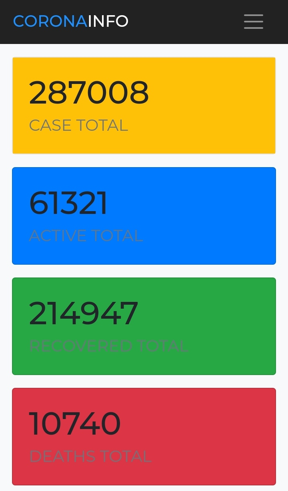

## Corona Web
* [Featurs](#featurs)
* [Installation](#installation)
* [Chat Admin](#chat-admin)

## Featurs
* Show Status Global
* Show Status Indonesian
* Show Status Indonesian Province (Next Update)
* Live Comments (Next Update)

## Installation
```
$ apt-get update
$ apt install python
$ apt install git
$ pip install requests flask
$ python3 -m pip install requests flask
$ git clone https://github.com/anonkyuhuu/CoronaWeb
$ cd CoronaWeb
$ python3 app.py
```

## Chat Admin
Click [Here](https://wa.me/62895611982226) To Chat Admin
